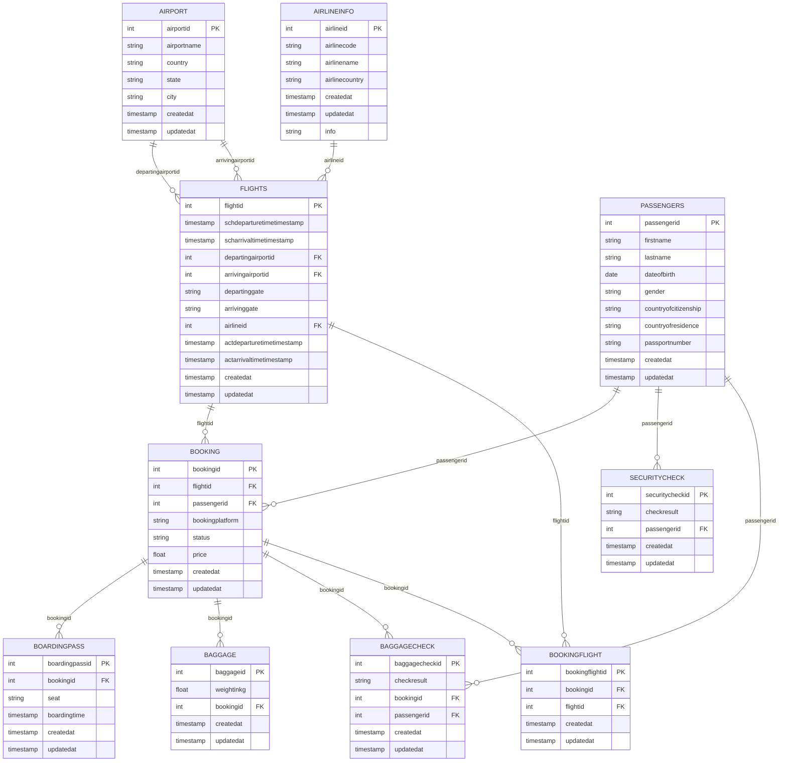

```mermaid
erDiagram
    AIRPORT {
        int airportid PK
        string airportname
        string country
        string state
        string city
        timestamp createdat
        timestamp updatedat
    }

    AIRLINEINFO {
        int airlineid PK
        string airlinecode
        string airlinename
        string airlinecountry
        timestamp createdat
        timestamp updatedat
        string info
    }

    FLIGHTS {
        int flightid PK
        timestamp schdeparturetimetimestamp
        timestamp scharrivaltimetimestamp
        int departingairportid FK
        int arrivingairportid FK
        string departinggate
        string arrivinggate
        int airlineid FK
        timestamp actdeparturetimetimestamp
        timestamp actarrivaltimetimestamp
        timestamp createdat
        timestamp updatedat
    }

    PASSENGERS {
        int passengerid PK
        string firstname
        string lastname
        date dateofbirth
        string gender
        string countryofcitizenship
        string countryofresidence
        string passportnumber
        timestamp createdat
        timestamp updatedat
    }

    BOOKING {
        int bookingid PK
        int flightid FK
        int passengerid FK
        string bookingplatform
        string status
        float price
        timestamp createdat
        timestamp updatedat
    }

    BOARDINGPASS {
        int boardingpassid PK
        int bookingid FK
        string seat
        timestamp boardingtime
        timestamp createdat
        timestamp updatedat
    }

    BAGGAGE {
        int baggageid PK
        float weightinkg
        int bookingid FK
        timestamp createdat
        timestamp updatedat
    }

    BAGGAGECHECK {
        int baggagecheckid PK
        string checkresult
        int bookingid FK
        int passengerid FK
        timestamp createdat
        timestamp updatedat
    }

    SECURITYCHECK {
        int securitycheckid PK
        string checkresult
        int passengerid FK
        timestamp createdat
        timestamp updatedat
    }

    BOOKINGFLIGHT {
        int bookingflightid PK
        int bookingid FK
        int flightid FK
        timestamp createdat
        timestamp updatedat
    }

    %% Relationships (One-to-Many)
    AIRPORT ||--o{ FLIGHTS : departingairportid
    AIRPORT ||--o{ FLIGHTS : arrivingairportid
    AIRLINEINFO ||--o{ FLIGHTS : airlineid
    PASSENGERS ||--o{ BOOKING : passengerid
    PASSENGERS ||--o{ SECURITYCHECK : passengerid
    PASSENGERS ||--o{ BAGGAGECHECK : passengerid
    BOOKING ||--o{ BOARDINGPASS : bookingid
    BOOKING ||--o{ BAGGAGE : bookingid
    BOOKING ||--o{ BAGGAGECHECK : bookingid
    BOOKING ||--o{ BOOKINGFLIGHT : bookingid
    FLIGHTS ||--o{ BOOKING : flightid
    FLIGHTS ||--o{ BOOKINGFLIGHT : flightid
```
