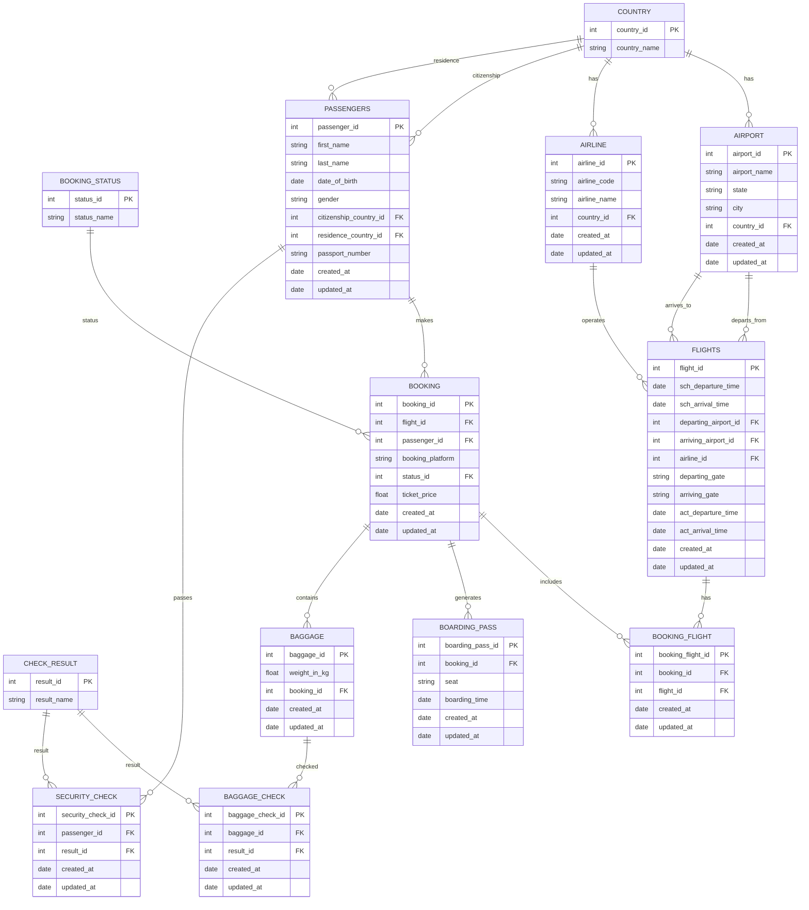

```mermaid
erDiagram
    COUNTRY {
        int country_id PK
        string country_name
    }

    BOOKING_STATUS {
        int status_id PK
        string status_name
    }

    CHECK_RESULT {
        int result_id PK
        string result_name
    }

    AIRPORT {
        int airport_id PK
        string airport_name
        string state
        string city
        int country_id FK
        date created_at
        date updated_at
    }

    AIRLINE {
        int airline_id PK
        string airline_code
        string airline_name
        int country_id FK
        date created_at
        date updated_at
    }

    FLIGHTS {
        int flight_id PK
        date sch_departure_time
        date sch_arrival_time
        int departing_airport_id FK
        int arriving_airport_id FK
        int airline_id FK
        string departing_gate
        string arriving_gate
        date act_departure_time
        date act_arrival_time
        date created_at
        date updated_at
    }

    PASSENGERS {
        int passenger_id PK
        string first_name
        string last_name
        date date_of_birth
        string gender
        int citizenship_country_id FK
        int residence_country_id FK
        string passport_number
        date created_at
        date updated_at
    }

    BOOKING {
        int booking_id PK
        int flight_id FK
        int passenger_id FK
        string booking_platform
        int status_id FK
        float ticket_price
        date created_at
        date updated_at
    }

    BOOKING_FLIGHT {
        int booking_flight_id PK
        int booking_id FK
        int flight_id FK
        date created_at
        date updated_at
    }

    BOARDING_PASS {
        int boarding_pass_id PK
        int booking_id FK
        string seat
        date boarding_time
        date created_at
        date updated_at
    }

    BAGGAGE {
        int baggage_id PK
        float weight_in_kg
        int booking_id FK
        date created_at
        date updated_at
    }

    BAGGAGE_CHECK {
        int baggage_check_id PK
        int baggage_id FK
        int result_id FK
        date created_at
        date updated_at
    }

    SECURITY_CHECK {
        int security_check_id PK
        int passenger_id FK
        int result_id FK
        date created_at
        date updated_at
    }

    COUNTRY ||--o{ AIRPORT : has
    COUNTRY ||--o{ AIRLINE : has
    COUNTRY ||--o{ PASSENGERS : citizenship
    COUNTRY ||--o{ PASSENGERS : residence

    AIRPORT ||--o{ FLIGHTS : departs_from
    AIRPORT ||--o{ FLIGHTS : arrives_to
    AIRLINE ||--o{ FLIGHTS : operates

    FLIGHTS ||--o{ BOOKING_FLIGHT : has
    BOOKING ||--o{ BOOKING_FLIGHT : includes
    BOOKING ||--o{ BOARDING_PASS : generates
    BOOKING ||--o{ BAGGAGE : contains
    BAGGAGE ||--o{ BAGGAGE_CHECK : checked

    PASSENGERS ||--o{ BOOKING : makes
    PASSENGERS ||--o{ SECURITY_CHECK : passes

    BOOKING_STATUS ||--o{ BOOKING : status
    CHECK_RESULT ||--o{ BAGGAGE_CHECK : result
    CHECK_RESULT ||--o{ SECURITY_CHECK : result
```
